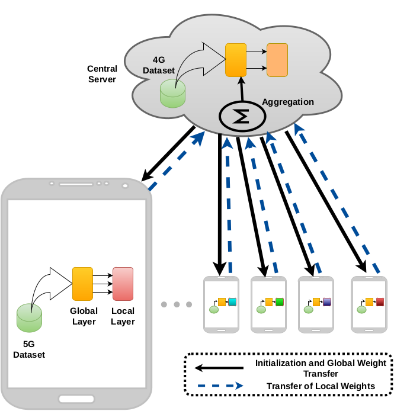

# fedput

Pervasive applications over large-scale, distributed embedded devices and the Internet of Things (IoT) demand precise coordination with the network; for example, several such applications, like collaborative video streaming and live analysis, augmented reality, etc., need continuous monitoring of network throughput and adapt the application behavior accordingly. Although the idea of network throughput prediction is not new and quite dated, in this paper, we show that the existing approaches fail to correctly infer the throughput when the network operator or the device change, and thus, not generic enough for Internet-scale applications. We propose FedPut, a novel approach that allows collaborative training across different client hardware by capturing throughput variations based on devices’ sensitivity towards the corresponding network configurations. Rigorous evaluations show that FedPut outperforms various standard baseline algorithms with more than 80% R2-score over different
datasets. We also analyze the performance of FedPut over a network-aware streaming media application and demonstrate its efficacy for various application scenarios.



<hr>

### File Description

 To run and test the throughput prediction algorithms for different thoughput datasets with standard centralized learning run **central_learning.py**. The helper functions for preparing the datasets and the fedput implementation is provided in **fedput.py**. To test fedput under [Tensorflow-Federated](https://www.tensorflow.org/federated) setup use **tff_eval.py**. 

In this work, we have proposed <i>FedPut</i>, a FL based throughput prediction algorithm for cellular networks. Unlike existing machine learning-based throughput prediction algorithms which are trained using centralized datasets, the proposed algorithm facilitates distributed trai neural network-based model at end-devices. This addresses the issue that service providers may be reluctant to share their proprietary network information. Additionally, the use of FL incorporates the user-specific variations of throughput into the prediction engine, which makes it suitable for a wide range of pervasive applications.


## Reference
To refer <i>FedPut</i> framework, please cite the following work.

BibTex Reference:
```
@inproceedings{Sen2023RevisitingCT,
  title={Revisiting Cellular Throughput Prediction over the Edge: Collaborative Multi-device, Multi-network in-situ Learning},
  author={Argha Sen and Ayan Zunaid and Soumyajit Chatterjee and Basabdatta Palit and Sandip Chakraborty},
  year={2023}
}
```
For questions and general feedback, contact Argha Sen (arghasen10@gmail.com).
